<div align="center">

[](https://git.io/typing-svg)



</div>


<div align="center">
  
</div>

---

### How to reach me

<p align="center">
  <a href="https://x.com/realh4k3d">
    
  </a>
</p>

---

### Languages & Tools

<div align="center">

```
/░      /█▀▀█    /░ /░    /█▀▀▀    /░/░    /█▀▀█    /█▀▀▀    /█▀▀▀/
│ ▒     │ ▓▓▓▓   │ ▒▒ ▒   │ ▓/▓▓   │ ▒ ▒   │ ▓▓▓▓   │ ▓/▓▓   │ ▓▓▓  
│ ▓     │_▒_/▒   │ ▓│▓▓   │ ▒//▒   │ ▓ ▓   │_▒_/▒   │ ▒//▒   │_▒_/  
│ ███   │ ░│ ░   │ █│ █   │ ░░░░   │ ███   │ ░│ ░   │ ░░░░   │ ░░░░ 
│/__/   │//│//   │//│//   │/___/   │/__/   │//│//   │/___/   │/___/
```

</div>

<p align="center">
  
</p>

<p align="center">
  <b>Recon & Exploitation:</b> Nmap · Burp Suite · Metasploit · ffuf / gobuster<br>
  <b>Scripting:</b> Python · Bash<br>
  <b>Environment:</b> Kali Linux · Docker
</p>

---
```
 /░░░    /░░░░    /█▀▀▀/    /░░░░    /█▀▀█    /░░░    /░░░    /░ /░    /█▀▀▀            /░░░    /░  /░     /░░░    /░░░    /█▀▀▀/    /░░░░░     /░░░
│_▒/▒   │_▒ /▒   │ ▓▓▓     │_▒ /▒   │ ▓▓▓▓   │//▒/   │/_▒/   │ ▒▒ ▒   │ ▓/▓▓           │ ▒_/   │//▒/▒/    │ ▒_/   │//▒/   │ ▓▓▓     │ ▒ ▒ ▒    │ ▒_/
│ ▓ ▓   │ ▓▓▓/   │_▒_/     │ ▓▓▓/   │_▒_/▒    │ ▓     │ ▓    │ ▓│▓▓   │ ▒//▒           │/_▓     │//▓/     │/_▓     │ ▓    │_▒_/     │ ▓ ▓ ▓    │/_▓ 
│ ███   │ █_/    │ ░░░░    │ █_/█   │ ░│ ░    │ █     /███   │ █│ █   │ ░░░░           /███      │ █      /███     │ █    │ ░░░░    │ █ █ █    /███ 
│/__/   │//      │/___/    │// //   │//│//    │//    │/__/   │//│//   │/___/          │/__/      │//     │/__/     │//    │/___/    │//////   │/__/ 

```
<p align="center">
  
  
  
</p>

---

### Currently Hunting On

<div align="center">

```
/░░░░    /░      /█▀▀█    /░░░    /░░░░    /░░░    /░░░░    /░░░░░
│_▒ /▒   │ ▒     │ ▓▓▓▓   │//▒/   │_▒__/   │_▒/▒   │_▒ /▒   │ ▒ ▒ ▒
│ ▓▓▓/   │ ▓     │_▒_/▒    │ ▓    │ ▓▓▓    │ ▓ ▓   │ ▓▓▓/   │ ▓ ▓ ▓
│ █_/    │ ███   │ ░│ ░    │ █    │_█_/    │ ███   │ █_/█   │ █ █ █
│//      │/__/   │//│//    │//    │//      │/__/   │// //   │//////
```

</div>

<p align="center">
  
</p>

<div align="center">
<table>
<tr>
<td align="center" width="120">

</td>
<td align="left">
&nbsp;&nbsp;<b>H4K3D</b> on Hack The Box<br>
&nbsp;&nbsp;Rank: <b>Professional</b><br>
&nbsp;&nbsp;<a href="https://app.hackthebox.com/users/2035988">View full profile →</a>
</td>
</tr>
</table>

<a href="https://app.hackthebox.com/users/2035988">
  
</a>
</div>

---

### Pinned Repositories

<p align="center">
  <a href="https://github.com/0h4k3d/h4k3d">
    
  </a>
  <a href="https://github.com/0h4k3d/BugHunter">
    
  </a>
</p>
<p align="center">
  <a href="https://github.com/0h4k3d/CSRF-0-protection-Room">
    
  </a>
</p>

---

<details>
  <summary>My GitHub Stats (click to expand)</summary>
  <br>

  <div align="center">

  #### GitHub Trophies
  

  <br><br>

  
  

  <br><br>

  #### Streak
  

  </div>
</details>

---

<div align="center">

### Disclaimer
All security research shown here is conducted in authorized lab environments (HTB, TryHackMe, personal labs) or through authorized bug bounty programs. No unauthorized access, ever.

**Show some support by starring my repositories!**


</div>
